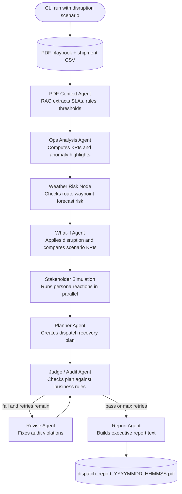

# MSBA AI Agents Demo

This project implements a command-line LangGraph pipeline for the UCLA MSBA AI Agents Project Challenge. It turns the SeeWeeS specialty medicine dispatch prototype into a multi-agent workflow with PDF-grounded business rules, shipment KPI analysis, weather risk, what-if simulation, stakeholder review, a planner, and an audit loop before report generation.

## Project Structure

```text
data/
  Incoming_shipment_03_06.csv       Raw shipment data (86 shipments)
  SeeWeeS Specialty Dispatch Playbook.pdf
  About SeeWeeS Specialty distribution.pdf
src/main.py            CLI entry point
src/graph.py           LangGraph workflow
src/agents.py          LLM agent wrappers
src/prompts*.py        Agent prompt templates
src/nodes/             What-if, stakeholder, and audit nodes
src/tools/             PDF, CSV, KPI, weather, and report helpers
tests/                 Unit tests for deterministic logic
requirements.txt       Python dependencies
.env.example           Environment variable template
```

Generated files such as `dispatch_report_*.pdf`, `chroma_db/`, `__pycache__/`, and `.pytest_cache/` are intentionally ignored.

## Agentic Flow



## Requirements

Use Python 3.11 or newer. The app requires:

- an OpenAI API key
- internet access for OpenAI and Open-Meteo API calls

## Setup

```bash
python3 -m venv .venv
source .venv/bin/activate
python -m pip install --upgrade pip
python -m pip install -r requirements.txt
cp .env.example .env
```

Edit `.env` and set your API key:

```text
OPENAI_API_KEY="your_openai_api_key_here"
```

Optional overrides (all have sensible defaults):

| Variable | Default | Purpose |
|---|---|---|
| `WEATHER_TZ` | `America/New_York` | Timezone for Open-Meteo forecasts |
| `WEATHER_LAT` | `40.7282` | Fallback latitude if PDF waypoints cannot be parsed |
| `WEATHER_LON` | `-74.0776` | Fallback longitude |

## Run

```bash
python src/main.py --disruption demand_spike
```

Supported scenarios:

```bash
python src/main.py --disruption demand_spike --multiplier 1.3
python src/main.py --disruption driver_shortage --shortage-pct 30
python src/main.py --disruption warehouse_closure --location Boston-MGH
python src/main.py --disruption weather_event --risk-score 2
```

The command prints each pipeline step and writes `dispatch_report_YYYYMMDD_HHMMSS.pdf` to the project folder.

## Test

```bash
PYTHONPATH=src pytest
```

# SeeWeeS Dispatch Report Dashboard

Standalone Next.js prototype for the UCLA MSBA AI Agents Project Challenge dashboard.

The dashboard uses static KPI snapshots from the completed teammate LangGraph pipeline. It does not import Python code, CSV files, PDFs, generated reports, or anything outside this `web/` folder, so the folder can be moved into another repository and still run independently.

## Local Development

```bash
cd web
npm install
npm run dev
```

Open `http://localhost:3000`.

## Build

```bash
npm run build
```

## Vercel

Deploy this folder as the Vercel project root.

## Data Source

The static scenario data lives in `lib/scenarios.ts` and reflects these teammate pipeline scenarios:

- Demand Spike x1.2
- Driver Shortage: 30% unavailable
- Warehouse Closure: Boston-MGH
- Weather Event: risk 2/3

If the Python pipeline outputs new KPI results later, update `lib/scenarios.ts` and rebuild the app.

## Notes

Do not commit `.env` or API keys. The PDF vector index in `chroma_db/` is a local cache and can be rebuilt by rerunning the app.
